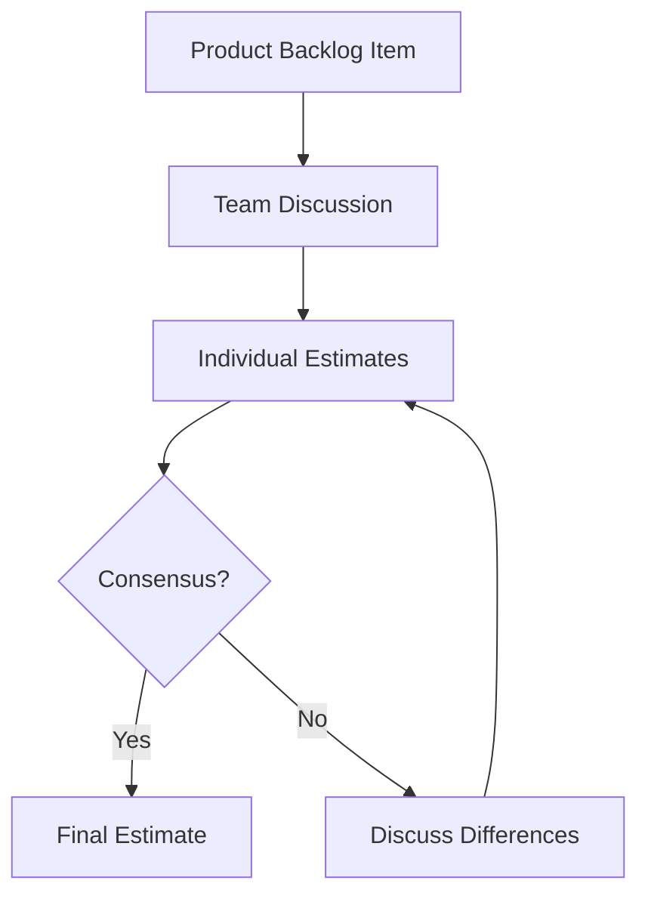
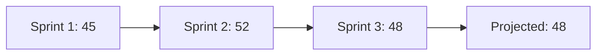
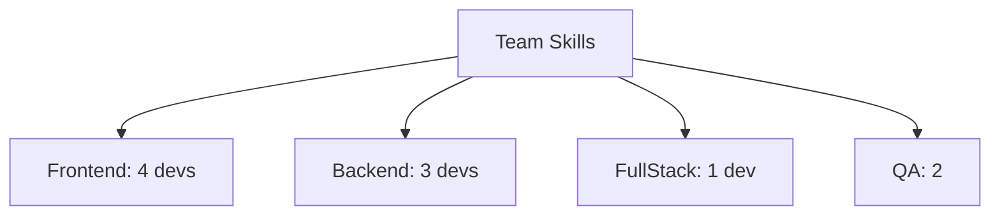

# Agile Estimation Guide for 10-Person Teams

## Table of Contents
1. [Estimation Techniques](#estimation-techniques)
2. [Real-world Examples](#real-world-examples)
3. [Estimation Workflows](#estimation-workflows)
4. [Team Velocity](#team-velocity)
5. [Capacity Planning](#capacity-planning)
6. [Common Pitfalls](#common-pitfalls)
7. [Story Point Calibration](#story-point-calibration)
8. [Team Composition Impact](#team-composition-impact)

## Estimation Techniques

### 1. Planning Poker
- **Description**: Consensus-based estimation using Fibonacci numbers
- **Implementation**: Team members simultaneously reveal their estimates
- **Best for**: Detailed user stories with clear acceptance criteria

### 2. T-Shirt Sizing
- **Description**: Simple XS, S, M, L, XL categorization
- **Implementation**: Quick initial sizing of features
- **Best for**: Early project planning and backlog grooming

### 3. Story Points
- **Description**: Relative sizing based on complexity, effort, and uncertainty
- **Implementation**: Using Fibonacci sequence (1,2,3,5,8,13,21)
- **Best for**: Sprint planning and release planning

## Real-world Examples

### Example 1: User Authentication Feature

```
Feature: Implement OAuth2 Authentication
Team Size: 10 (6 developers, 2 QA, 1 UX, 1 Scrum Master)

Story Point Breakdown:
- API Integration: 5 points
- Frontend Implementation: 3 points
- Security Testing: 3 points
- UI/UX Design: 2 points

Total: 13 story points
Expected Duration: 2 sprints
```

### Example 2: Report Generation Module

```
Feature: Sales Analytics Dashboard
Team Capacity: 80 story points per sprint

Component Breakdown:
- Data Pipeline: 8 points
- Visualization: 5 points
- Export Functionality: 3 points
- User Preferences: 2 points

Total: 18 story points
Expected Duration: 1 sprint
```

## Estimation Workflows



## Team Velocity

### Calculation Method
```
Sprint Velocity = Total Completed Story Points / Number of Sprints

Example for 10-person team:
Sprint 1: 45 points
Sprint 2: 52 points
Sprint 3: 48 points

Average Velocity = (45 + 52 + 48) / 3 = 48.3 points
```

### Velocity Tracking Chart



## Capacity Planning

### Team Capacity Matrix

| Role | Members | Story Points/Sprint | Notes |
|------|---------|-------------------|--------|
| Developer | 6 | 8-10 each | Backend/Frontend tasks |
| QA | 2 | 6-8 each | Testing/Automation |
| UX Designer | 1 | 5-7 | Design/Research |
| Scrum Master | 1 | N/A | Process facilitation |

### Sprint Planning Formula
```
Available Capacity = (Team Size × Working Days) - (Meetings + PTO)
Example:
10 people × 10 days = 100 days
Minus meetings (15 days) = 85 available days
```

## Common Pitfalls

1. **Overestimation**
- Cause: Adding buffers at every level
- Solution: Use historical data for validation

2. **Pressure to Lower Estimates**
- Cause: External deadline pressure
- Solution: Focus on accuracy over speed

3. **Inconsistent Story Points**
- Cause: Lack of calibration
- Solution: Regular calibration sessions

## Story Point Calibration

### Reference Stories

```
1 Point Story:
- Simple UI text change
- Config file update

3 Point Story:
- New form field with validation
- Simple API endpoint

5 Point Story:
- New feature with DB changes
- Integration with external service
```

## Team Composition Impact

### Skill Matrix



### Impact Factors

1. **Skill Distribution**
- Cross-functional capabilities
- Specialization areas

2. **Experience Levels**
- Senior: 4 members
- Mid-level: 4 members
- Junior: 2 members

3. **Team Dynamics**
- Pair programming frequency
- Knowledge sharing sessions

## Best Practices

1. **Regular Calibration**
- Monthly refinement sessions
- Reference story reviews

2. **Data-Driven Adjustments**
- Track estimation accuracy
- Adjust based on actual completion times

3. **Clear Documentation**
- Document estimation rationale
- Maintain historical estimates

4. **Continuous Improvement**
- Retrospective analysis
- Team feedback incorporation

