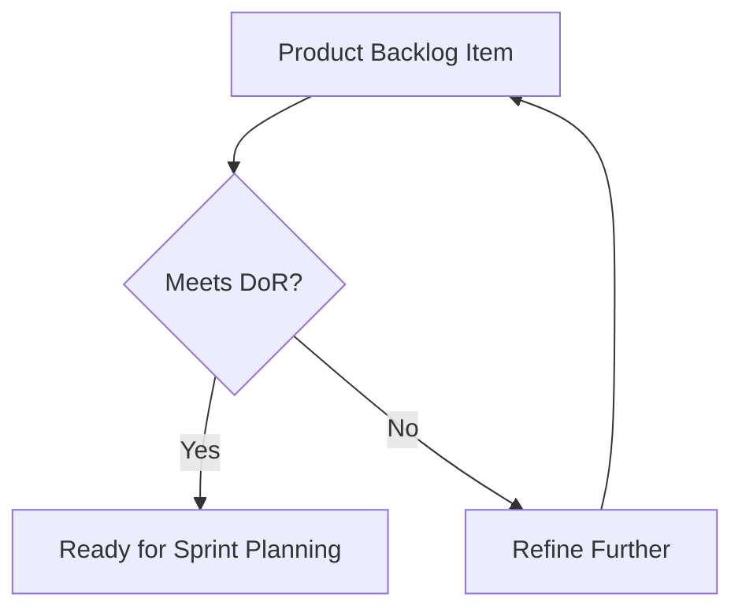
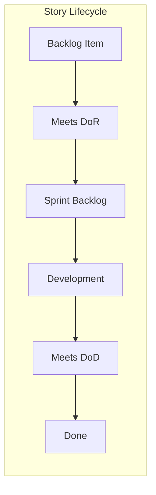

# Definition of Ready (DoR) vs Definition of Done (DoD) in Scrum

## Table of Contents
- [Overview](#overview)
- [Definition of Ready (DoR)](#definition-of-ready)
- [Definition of Done (DoD)](#definition-of-done)
- [Visual Representation](#visual-representation)
- [Real-world Examples](#real-world-examples)
- [Best Practices](#best-practices)

## Overview

| Aspect | Definition of Ready (DoR) | Definition of Done (DoD) |
|--------|---------------------------|-------------------------|
| Purpose | Ensures user stories are properly prepared before work begins | Ensures quality standards are met before work is considered complete |
| Timing | Before sprint planning | Throughout sprint execution |
| Owner | Product Owner (primary) | Development Team (primary) |
| Focus | Story preparation and clarity | Quality and completeness |

## Definition of Ready (DoR)

### Why DoR was Introduced
- Reduce mid-sprint blockers
- Improve sprint predictability
- Ensure efficient use of development time
- Minimize scope creep
- Enable better estimation

### Why DoR is Not in The Scrum Guide
The Definition of Ready is not officially part of the Scrum framework, and this is intentional. Here's why:

#### Official Scrum Guide Stance
- The Scrum Guide emphasizes empiricism and adaptability
- Product Backlog refinement is ongoing and collaborative
- No formal "ready" state is required before items enter a Sprint

#### Potential Drawbacks
- Can create unnecessary bureaucracy
- May lead to waterfall-like gates
- Risk of reducing agility and flexibility
- Could delay valuable work from starting

#### Conflicts with Scrum Principles
- May contradict the principle of "just enough, just in time"
- Could reduce the team's ability to respond to change
- Might create artificial barriers to progress
- Risk of over-preparation vs. learning through doing

#### Finding the Right Balance
1. Keep DoR lightweight and flexible
2. Use as guidelines, not strict rules
3. Adapt criteria based on context
4. Focus on value over process
5. Regular review and adjustment

### Common DoR Checklist
- [ ] User story follows INVEST criteria
- [ ] Acceptance criteria are clearly defined
- [ ] Dependencies identified and resolved
- [ ] Story is sized appropriately
- [ ] Required resources are available
- [ ] Technical approach is outlined
- [ ] UI/UX designs are complete (if applicable)

## Definition of Done (DoD)

### Benefits of DoD
1. **Quality Assurance**
- Consistent quality standards
- Reduced technical debt
- Improved maintainability

2. **Process Clarity**
- Clear completion criteria
- Reduced misunderstandings
- Improved team alignment

### Standard DoD Checklist
- [ ] Code completed and reviewed
- [ ] Unit tests written and passing
- [ ] Integration tests passing
- [ ] Documentation updated
- [ ] Code merged to main branch
- [ ] QA approval obtained
- [ ] Performance metrics met

## Visual Representation

## Real-world Examples

### E-commerce Feature Example

#### Definition of Ready Example
Feature: Add to Cart Button

**DoR Checklist:**
- [x] UI design approved
- [x] API endpoints documented
- [x] Performance requirements defined (< 300ms response)
- [x] Mobile responsiveness requirements clear
- [x] Security requirements identified
- [x] Dependencies on inventory service documented

#### Definition of Done Example
**DoD Checklist:**
- [x] Feature implemented according to design
- [x] Unit tests coverage > 80%
- [x] E2E tests passing
- [x] Performance tests show < 300ms response
- [x] Security scan passed
- [x] Browser compatibility verified
- [x] Product owner approval obtained

## Best Practices

### For Definition of Ready
1. Keep it lightweight but comprehensive
2. Adapt to project context
3. Review and update regularly
4. Involve the entire team in creation
5. Make it visible and accessible

### For Definition of Done
1. Make it measurable
2. Include non-functional requirements
3. Automate verification where possible
4. Update based on lessons learned
5. Consider organizational standards

### Warning Signs
- DoR too rigid → Delays in starting work
- DoD too lenient → Quality issues
- DoD too strict → Delivery bottlenecks

---

> **Note:** Both DoR and DoD should be living documents that evolve with team maturity and project needs.

