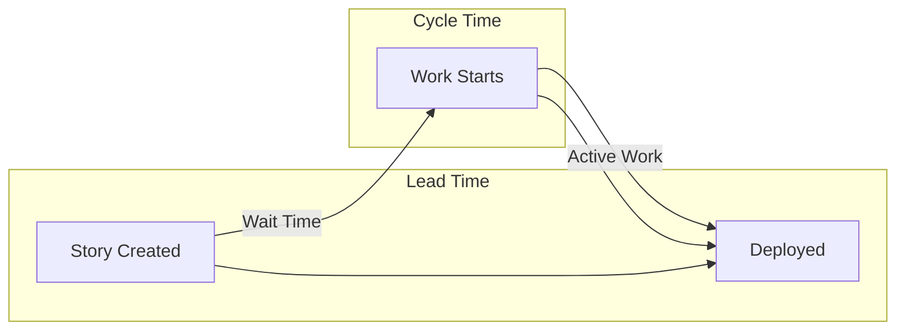

# Lead Time vs Cycle Time in Scrum: A Comprehensive Guide

## Definitions and Key Differences

**Lead Time** and **Cycle Time** are two crucial metrics in Agile project management that help teams understand and improve their delivery process.

- **Lead Time**: The total time from when a request is made until it's delivered
- _Starts_: When the item is created/requested
- _Ends_: When the item is delivered to production

- **Cycle Time**: The actual time spent working on an item
- _Starts_: When work actively begins on the item
- _Ends_: When the item is delivered to production

> 💡 Key Difference: Lead Time includes waiting time in the backlog, while Cycle Time only measures active work time.

## Real-World Example with Visualization

Let's consider a user story for implementing a new login feature:

```
Timeline Events:
Day 1:  Product Owner creates story
Day 2-5: Story waits in backlog
Day 6:  Development begins
Day 8:  Development completed
Day 9:  Testing completed
Day 10: Feature deployed
```

### Visual Representation
```
Lead Time (10 days total)
|-------------------------------------------|
Day 1                                    Day 10
↓                    ↓                      ↓
Story Created    Work Starts            Deployed
                |----------------------|
                Cycle Time (5 days)
```

### Relationship Diagram


### Sprint Timeline Example
```
Story 1  |----[Wait]----[Dev]--[Test]-|
Story 2      |--[Wait]---[Dev]-[Test]--|
Story 3          |---[Wait]--[Dev/Test]-|

Timeline  |----------------------------->
Sprint Days:  1   2   3   4   5   6   7   8

[Wait] = Backlog waiting time
[Dev]  = Development time
[Test] = Testing time
```

### Kanban Flow Visualization
```
+------------+  +------------+  +------------+  +------------+
|  Backlog   |  |    Dev     |  |   Test     |  |   Done     |
+------------+  +------------+  +------------+  +------------+
| Story 3    |  | Story 2    |  | Story 1    |  |            |
| Story 4    |  |            |  |            |  |            |
| Story 5    |  |            |  |            |  |            |
+------------+  +------------+  +------------+  +------------+

|<------- Lead Time for Story 1 ----------------------->|
            |<---- Cycle Time for Story 1 ----------->|
```

## Using Metrics for Sprint Velocity and Planning

### 1. Sprint Velocity Optimization
- Calculate average Lead Time and Cycle Time per story point
- Identify bottlenecks where Lead Time >> Cycle Time
- Monitor trends across sprints

### 2. Planning Improvements
- **WIP Limits**: Set based on average Cycle Time
- Example: If Cycle Time = 5 days, limit concurrent stories to `Sprint Duration / 5`

- **Capacity Planning**:
- Use formula: `Sprint Capacity = (Sprint Days × Team Size) / Avg Cycle Time per Story`
- Account for meetings and other non-development activities

## Practical Implementation Steps

### 1. Set Up Tracking
- Create a tracking spreadsheet with columns:
* Story ID
* Story Points
* Creation Date
* Work Start Date
* Completion Date
* Lead Time
* Cycle Time

### 2. Data Collection Process
1. Record timestamps at key events:
- Story creation
- Work initiation
- Completion
2. Calculate metrics automatically
3. Update daily during stand-ups

### 3. Analysis and Action
- Review metrics in sprint retrospectives
- Identify patterns and anomalies
- Set improvement goals for next sprint

## Best Practices and Tips

1. **Keep It Simple**
- Start with basic tracking
- Add complexity as needed
- Focus on trends over exact numbers

2. **Regular Review**
- Weekly metrics review
- Monthly trend analysis
- Quarterly goal setting

3. **Team Involvement**
- Share metrics transparently
- Discuss improvements collectively
- Celebrate progress

## Common Pitfalls to Avoid

- Don't compare metrics across different teams
- Avoid using metrics punitively
- Don't ignore context when analyzing outliers
- Remember that not all work items are equal

---

*Remember: These metrics are tools for improvement, not judgment. Use them to identify opportunities for process optimization and team empowerment.*

