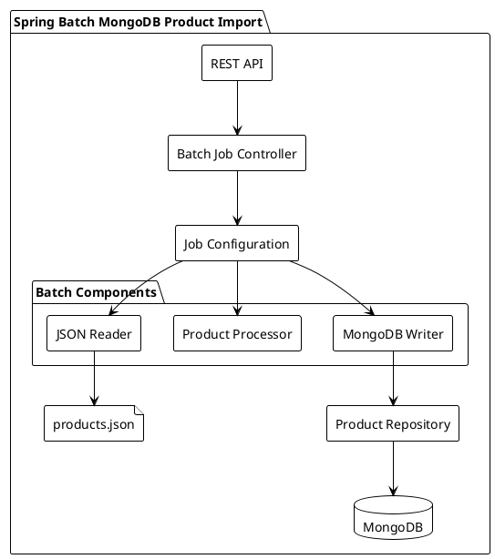
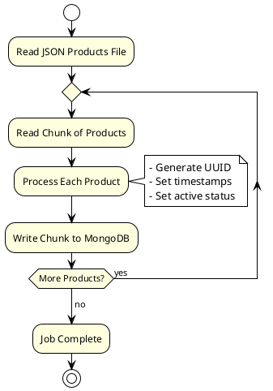
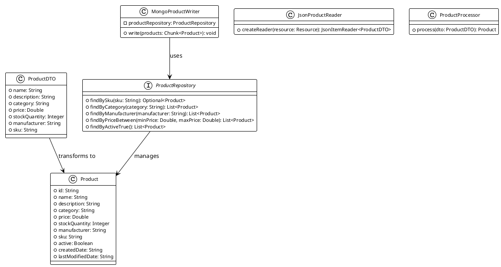
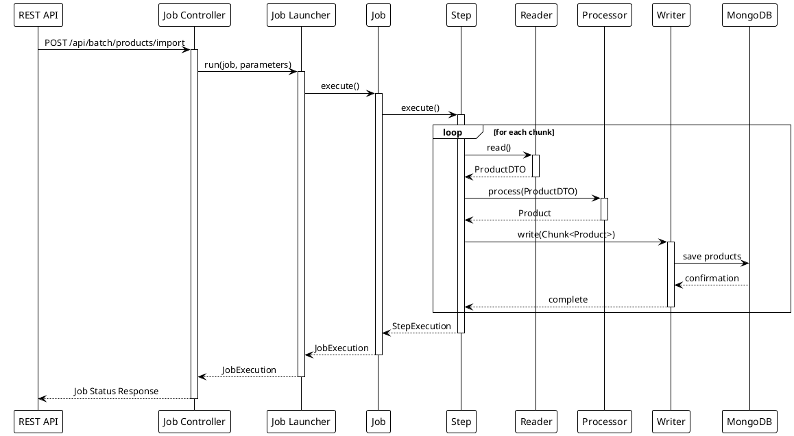

# Architecture Diagrams

## Component Architecture

## Batch Processing Flow

## Class Diagram

## Job Execution Sequence

These diagrams illustrate:
1. The overall component architecture and their interactions
2. The flow of batch processing operations
3. The class structure and relationships
4. The sequence of operations during job execution

They help in understanding:
- System components and their relationships
- Data flow through the system
- Processing steps and transformations
- Runtime behavior and interactions

