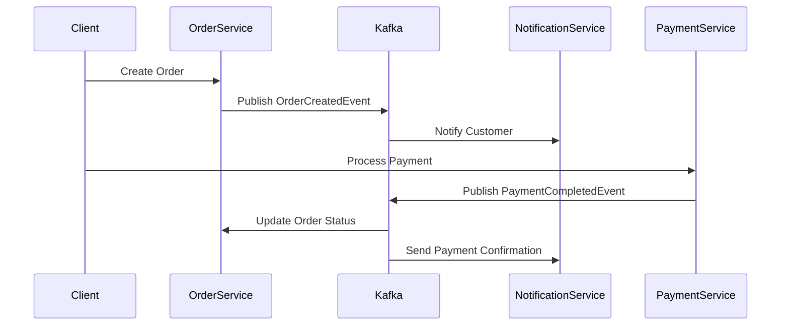

# Spring Boot Domain Events with Kafka Demo

A demonstration of domain events pattern implementation using Spring Boot and Apache Kafka, showcasing event-driven architecture in a microservices environment.

## Architecture Overview

```ascii
                                     +-------------------+
                                     |   Order Service   |
                                     | (Event Publisher) |
                                     +--------+---------+
                                              |
                                              | Domain Events
                                              v
                                     +-------------------+
                                     |  Apache Kafka     |
                                     | (Event Backbone)  |
                                     +--------+---------+
                                              |
                        +--------------------+|+--------------------+
                        |                    |                     |
                        v                    v                     v
              +------------------+ +------------------+ +--------------------+
              |  Notification    | |    Inventory     | |     Analytics     |
              |    Service      | |     Service      | |      Service      |
              | (Event Consumer) | | (Event Consumer) | |  (Event Consumer) |
              +------------------+ +------------------+ +--------------------+


Event Flow:
+--------------+     +--------------+     +----------------+     +------------------+
|Order Created |---->|Event Published|--->| Kafka Topics   |---->| Consumer Services|
+--------------+     +--------------+     +----------------+     +------------------+
                                                |
                                         +------+------+
                                         | Processed by|
                                         +------------+
                                         | • Notification
                                         | • Inventory
                                         | • Analytics
                                         +------------+
```

## Key Components and Responsibilities

### 1. Order Service (Publisher)
- Handles order creation and management
- Publishes domain events for significant state changes
- Maintains order consistency and business logic

### 2. Event Publishers
- Implements domain event publishing mechanism
- Ensures reliable event delivery
- Handles event serialization and Kafka integration

### 3. Apache Kafka
- Acts as the event backbone
- Provides reliable message delivery
- Enables event persistence and replay
- Supports multiple consumer groups

### 4. Event Consumers
- **Notification Service**: Sends order confirmations and updates
- **Inventory Service**: Updates stock levels and manages reservations
- **Analytics Service**: Processes events for reporting and insights

## Getting Started

### Prerequisites
- Java 17 or higher
- Maven 3.6+
- Docker (for running Kafka)
- Docker Compose

### Environment Setup
1. Clone the repository:
   ```bash
   git clone https://github.com/yourusername/spring-domain-events-kafka-demo.git
   ```

2. Start Kafka using Docker Compose:
   ```bash
   docker-compose up -d
   ```

3. Build the project:
   ```bash
   mvn clean install
   ```

4. Run the application:
   ```bash
   mvn spring-boot:run
   ```

## Project Structure
```
├── src/
│   ├── main/
│   │   ├── java/
│   │   │   └── com/example/
│   │   │       ├── order/
│   │   │       ├── events/
│   │   │       ├── notification/
│   │   │       ├── inventory/
│   │   │       └── analytics/
│   │   └── resources/
│   └── test/
├── docs/
│   └── explanation/
├── docker-compose.yml
├── pom.xml
└── README.md
```

## Documentation
Detailed documentation for each component can be found in the `docs/explanation` directory:
- [Domain Events Overview](docs/explanation/ReadMe-Explanation-DomainEvents.md)
- [Kafka Configuration](docs/explanation/ReadMe-Explanation-KafkaConfig.md)
- [Order Service Implementation](docs/explanation/ReadMe-Explanation-OrderService.md)
- [Event Consumers Implementation](docs/explanation/ReadMe-Explanation-EventConsumers.md)

# Event-Driven E-commerce System

## Table of Contents
- [Overview](#overview)
- [Key Features](#key-features)
- [Prerequisites](#prerequisites)
- [Setup Instructions](#setup-instructions)
- [Running the Application](#running-the-application)
- [API Documentation](#api-documentation)
- [Sample Event Flows](#sample-event-flows)
- [Troubleshooting Guide](#troubleshooting-guide)
- [Support](#support)

## Overview
This Spring Boot application implements an event-driven e-commerce system using Apache Kafka for message processing. The system handles order creation, payment processing, inventory management, and customer notifications asynchronously.

### Key Features
- Asynchronous event processing using Kafka
- Order lifecycle management
- Payment processing
- Real-time customer notifications
- Inventory tracking
- RESTful API endpoints

## Prerequisites
- Java 11 or higher
- Maven 3.6+
- Apache Kafka 2.8+
- Docker (optional, for containerized setup)

## Setup Instructions

### 1. Clone the Repository
```bash
git clone https://github.com/yourusername/ecommerce-event-driven.git
cd ecommerce-event-driven
```

### 2. Configure Kafka
Start Kafka using Docker:
```bash
docker-compose up -d
```

Or configure local Kafka instance in `application.properties`:
```properties
spring.kafka.bootstrap-servers=localhost:9092
spring.kafka.consumer.group-id=ecommerce-group
```

### 3. Build the Application
```bash
mvn clean install
```

## Running the Application

### Start the Application
```bash
mvn spring-boot:run
```

The application will start on `http://localhost:8080`

## API Documentation

### 1. Create Order
```bash
curl -X POST http://localhost:8080/api/orders \
  -H "Content-Type: application/json" \
  -d '{
    "customerId": "CUST123",
    "items": [
      {
        "productId": "PROD456",
        "quantity": 2,
        "price": 29.99
      }
    ],
    "shippingAddress": {
      "street": "123 Main St",
      "city": "Boston",
      "zipCode": "02108"
    }
  }'
```

Response:
```json
{
  "orderId": "ORD-2023-001",
  "status": "CREATED",
  "totalAmount": 59.98,
  "timestamp": "2023-11-15T10:30:00Z"
}
```

### 2. Process Payment
```bash
curl -X POST http://localhost:8080/api/orders/ORD-2023-001/payment \
  -H "Content-Type: application/json" \
  -d '{
    "paymentMethod": "CREDIT_CARD",
    "amount": 59.98,
    "cardDetails": {
      "cardNumber": "4111111111111111",
      "expiryMonth": "12",
      "expiryYear": "2025"
    }
  }'
```

Response:
```json
{
  "paymentId": "PAY-2023-001",
  "status": "COMPLETED",
  "orderId": "ORD-2023-001",
  "timestamp": "2023-11-15T10:31:00Z"
}
```

### 3. Check Order Status
```bash
curl http://localhost:8080/api/orders/ORD-2023-001/status
```

Response:
```json
{
  "orderId": "ORD-2023-001",
  "status": "PROCESSING",
  "lastUpdated": "2023-11-15T10:31:00Z",
  "events": [
    {
      "type": "ORDER_CREATED",
      "timestamp": "2023-11-15T10:30:00Z"
    },
    {
      "type": "PAYMENT_COMPLETED",
      "timestamp": "2023-11-15T10:31:00Z"
    }
  ]
}
```

## Sample Event Flows

### Complete Order Processing Flow
1. Order Creation → Payment → Fulfillment


### Sample Events
1. Order Created Event:
```json
{
  "eventType": "ORDER_CREATED",
  "orderId": "ORD-2023-001",
  "timestamp": "2023-11-15T10:30:00Z",
  "data": {
    "customerId": "CUST123",
    "amount": 59.98,
    "status": "CREATED"
  }
}
```

2. Payment Completed Event:
```json
{
  "eventType": "PAYMENT_COMPLETED",
  "paymentId": "PAY-2023-001",
  "orderId": "ORD-2023-001",
  "timestamp": "2023-11-15T10:31:00Z",
  "data": {
    "amount": 59.98,
    "paymentMethod": "CREDIT_CARD"
  }
}
```

## Troubleshooting Guide

### Monitoring and Diagnostics
1. Application Logs
```bash
tail -f logs/application.log
```

2. Kafka Topic Management
```bash
# List topics
kafka-topics.sh --bootstrap-server localhost:9092 --list

# View messages in a topic
kafka-console-consumer.sh --bootstrap-server localhost:9092 \
  --topic order-events --from-beginning
```

### Common Issues and Solutions

#### 1. Kafka Connection Issues
**Error**: `org.apache.kafka.common.errors.TimeoutException`
**Solution**:
```bash
# Verify Kafka is running
docker ps

# Check Kafka connectivity
nc -zv localhost 9092
```

#### 2. Order Creation Failures
**Error**: Invalid order data
**Solution**: Verify required fields:
- customerId (required)
- items (at least one item)
- valid shipping address

#### 3. Payment Processing Errors
**Error**: Payment validation failed
**Solution**: Verify:
- Valid payment amount
- Correct card details format
- Sufficient funds

## Support
For additional support:
- Check the [docs/](/docs) directory for detailed documentation
- Submit issues on GitHub
- Contact the development team at dev@example.com
